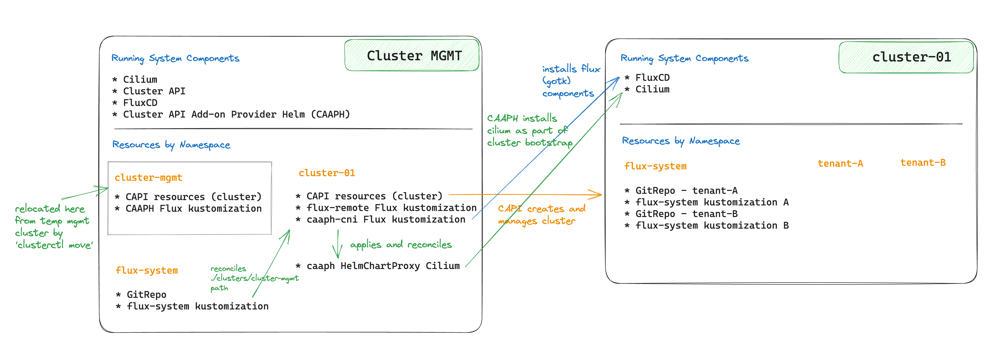

# Multi Cluster Management

This repository contains manifests and scripts to bootstrap clusters with [Cluster API](https://github.com/kubernetes-sigs/cluster-api). Currently only AWS clusters are supported, but more types will be added later (EKS and GCP).

# Tech Stack

* GitOps. Cluster(s) manifests are managed by [FluxCD](https://fluxcd.io/) and the repo structure follows ["repo per team example"](https://fluxcd.io/docs/guides/repository-structure/#repo-per-team).

* Infrastruture provisioning. Clusters are deployed using ["Boostrap & Pivot"](https://cluster-api.sigs.k8s.io/clusterctl/commands/move.html) approach with initial temporary management cluster running on `kind`.
Flux manifests are installed on each CAPI cluster by Flux running on the management cluster.
Even though it is not a recommended approach, in this project Flux is running in read-only mode (deploy key does not have write permissions).

* CNI. [cilium](https://cilium.io/). Because CNI needs to be installed during cluster bootstrap before anything else runs on the cluster it can't be managed by Flux. CAPI implemented [Cluster API Addon Provider for Helm (CAAPH)](https://github.com/kubernetes-sigs/cluster-api-addon-provider-helm) which allows to install helm charts for workload cluster during its bootstrap.

This might be possible to implement with: https://fluxcd.io/flux/components/kustomize/kustomizations/#remote-clusterscluster-api instead.

# Installation

## One Time Setup

Create CAPI IAM user. This will ensure the least privilege principle and give the ability to audit CAPI requests separately.
Refer to [aws/README.md](aws/README.md) for more details what required for initial AWS setup.

Setup workload clusters config as described in [config/README.md](config/README.md). Workload clusters can be set and removed on the go, they don't need to exist before running the deploy script.

## Deploy

Deploy permanent management cluster on AWS (using temp `kind` cluster and then pivot)

```
./scripts/deploy.sh
```

Kubeconfig file path can be provided in `K8S_MULTI_KUBECONFIG` env variable, it doesn't have to be an empty kubeconfig, but it will be modified by the script adding and removing entries for clusters and contexts that it manages.
If this variable is not provided then a kubeconfig in this repo root location will be created.

By choice, Flux is deployed in read only mode, and therefore it can't be bootstrapped as described in official documents. This requires additional steps including creating flux secret, this is done by separate script:

```
./scripts/helpers.sh -c
```

## Adding a new cluster

To add a new cluster create config env for it by copying existing file (`./config/cluster-<num>.env`) and modifying values.
This is intended to be manual step because the values must be provided by the end user, not guessed by the system, e.g. CIDRs.

```
./scripts/helper.sh -c cluster-02
```

This will generate all necessary files and add the cluster to mgmt kustomization list too. Then it will be pushed to the repo (example commit from the script: https://github.com/olga-mir/k8s-multi-cluster/pull/10/commits/92ee7e094881969736ed666a0e732f073ebc53c6), where flux will apply it and capi will provision it. The `./scripts/helper.sh` is still waiting for the cluster to come up and finalize the installation.

on mgmt cluster:
```
% k get cluster -A
NAMESPACE      NAME           PHASE          AGE   VERSION
cluster-01     cluster-01     Provisioned    12m
cluster-02     cluster-02     Provisioning   60s
cluster-mgmt   cluster-mgmt   Provisioned    13m
```

# Architecture

## Clusters



## Directory structure

[directory-structure](./docs/directory-structure.png)

# Cleanup

Delete clusters in clean CAPI way:
```
% ./scripts/cleanup.sh
```
The script will move all cluster definitions, including mgmt cluster (which at this point is hosted on the mgmt cluster itself) to the `kind` cluster and delete them in parallel.

When CAPI way is not working for some reasons (bugs), then you need to delete AWS resources that make up the clusters to avoid charges.

* delete NAT gateways.
* release Elastic IP(s).
* terminate EC2 instances.
* delete VPC.
(Resrouces usually are named `<cluster-name>-<resource-type>` pattern, e.g `mgmt-nat`, `mgmt-vpc`)

Alternatively, use script `./scripts/brutal-aws-cleanup.sh` - this script deletes everything it can find (in NATs, EIPs, EC2 instances, ELBs, but not VPCs) without checking if they are related to the clusters in this project. So it is not recommended to use if there are other resources in the account.
Apparenty deleting VPC is not for the faint-hearted, check out https://github.com/isovalent/aws-delete-vpc

# Future Features

* Cilium cluster mesh and Gateway API
* Private clusters
* Runtime Extentions
* Eliminate all bash scripts - use SDK, extentions, CAPI operator, etc. Not all of these were available when I started this project

# Resources

* https://www.weave.works/blog/manage-thousands-of-clusters-with-gitops-and-the-cluster-api
* [Weaveworks' The Power of GitOps with Flux youtube playlist](https://www.youtube.com/playlist?list=PL9lTuCFNLaD3fI_g-NXWVxopnJ0adn65d). One of the videos dedicated to CAPI
* [Cluster API Addon Provider for Helm](https://github.com/kubernetes-sigs/cluster-api-addon-provider-helm)
* [eCHO Episode 94: Cluster API and Cilium Cluster Mesh](https://www.youtube.com/live/HVqQhMRpUR4?si=UxZkr00vD2-pTSjF) - but you'll have to be very patient with this one. There is other interesting stuff like compiling linux kernel and `virtink`.
